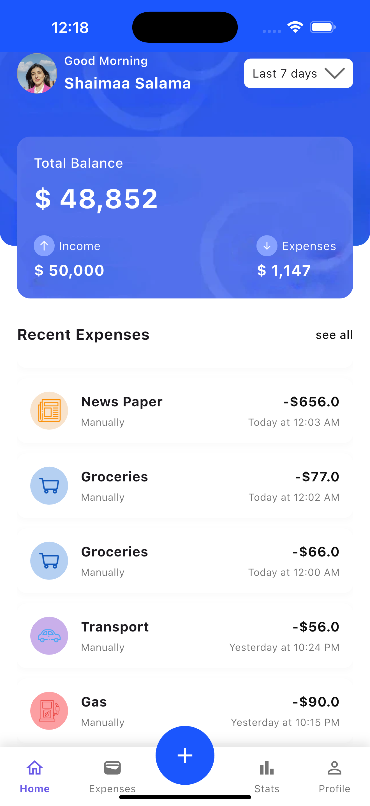

# Expense Tracker App 📊

A Flutter application for tracking expenses with BLoC state management, currency conversion, and local data persistence.

## Table of Contents
- [Architecture](#architecture-)
- [Features](#features-)
  - [Dashboard Screen](#1-dashboard-screen-)
  - [Add Expense Screen](#2-add-expense-screen-)
  - [Currency Conversion](#3-currency-conversion-)
  - [Pagination](#4-pagination-)
  - [Local Storage](#5-local-storage-)
  - [Expense Summary](#6-expense-summary-)
- [Dependencies](#dependencies-)
- [Getting Started](#getting-started-)
- [Folder Structure](#folder-structure-)
- [Testing](#testing-)

## Architecture 🏗️

### BLoC Pattern Implementation
```dart
// Example feature bloc structure
class ExpenseBloc extends Bloc<ExpenseEvent, ExpenseState> {
  ExpenseBloc(this.expenseRepository) : super(ExpenseInitial()) {
    on<LoadExpenses>((event, emit) async {
      emit(ExpenseLoading());
      try {
        final expenses = await expenseRepository.getExpenses();
        emit(ExpenseLoaded(expenses));
      } catch (e) {
        emit(ExpenseError(e.toString()));
      }
    });
  }
  
  final ExpenseRepository expenseRepository;
}
```

## Key Features ✨

### 🏠 Dashboard Screen
- Personalized user greeting with profile picture
- Financial overview cards:
  - 💰 Total balance
  - 📈 Total income
  - 📉 Total expenses
- Time period filters (This Month, Last 7 Days, Custom Range)
- 📜 Paginated recent transactions list
- ➕ Floating action button for quick expense addition

### ➕ Add Expense Screen
- 🗂️ Category selection with visual icons
- 💵 Amount input with currency validation
- 📅 Date picker with smart defaults
- 📸 Receipt image capture/upload
- 💱 Multi-currency support
- ✔️ Form validation and error handling

### 🔄 Paginated Lists
- 📋 10 items per page loading
- ⏳ Infinite scroll with loading indicators
- 🔍 Maintains filters during pagination
- 🖱️ "Load More" button alternative
- 📱 Responsive design for all screen sizes

### 💱 Currency Conversion
- 🌍 Real-time exchange rates via API
- 💵 Automatic conversion to base currency (USD)
- 📊 Stores both original and converted amounts
- ⚠️ Graceful error handling for offline mode
- 🔄 Background sync for updated rates

### 💾 Local Storage
- 🗄️ Hive NoSQL database implementation
- ⚡ Fast read/write operations
- 🔄 Data synchronization logic
- 📱 Platform-specific optimizations
- 🔒 Secure storage for sensitive data

### 📊 Expense Analytics
- 🥧 Interactive pie charts by category
- 📈 Time-based trend analysis
- 🔢 Custom reporting periods
- 🎨 Themed visualization widgets
- 📤 Export capability (CSV/PDF)

## Technical Architecture 🏗️

### BLoC State Management
```dart
// Typical BLoC implementation
class ExpenseBloc extends Bloc<ExpenseEvent, ExpenseState> {
  final ExpenseRepository repository;
  
  ExpenseBloc(this.repository) : super(ExpenseInitial()) {
    on<LoadExpenses>((event, emit) async {
      emit(ExpenseLoading());
      try {
        final expenses = await repository.getExpenses();
        emit(ExpenseLoaded(expenses));
      } catch (e) {
        emit(ExpenseError(e.toString()));
      }
    });
  }
}
```

## Project Structure 📂

### Key Directories Explained:

**`lib/core/`** - Reusable infrastructure:
- `constants/`: App-wide strings, routes, etc.
- `widgets/`: Shared UI components
- `themes/`: Colors, text styles, themes

**`lib/features/`** - Feature modules (each contains):
- `bloc/`: State management files
- `views/`: Full screens
- `widgets/`: Feature-specific components

**`lib/data/`** - Data layer:
- `datasources/`: Local (Hive) and remote (API)
- `models/`: Entity classes
- `repositories/`: Data access implementations

## Architecture 🏗️

### BLoC Implementation Example
```dart
class ExpenseBloc extends Bloc<ExpenseEvent, ExpenseState> {
  final ExpenseRepository repository;
  
  ExpenseBloc(this.repository) : super(ExpenseInitial()) {
    on<LoadExpenses>((event, emit) async {
      emit(ExpenseLoading());
      try {
        final expenses = await repository.getExpenses();
        emit(ExpenseLoaded(expenses));
      } catch (e) {
        emit(ExpenseError(e.toString()));
      }
    });
  }
}
```

## API Integration 🌐

### Currency Exchange API Requirement
The app integrates with a REST API for real-time currency conversion:

```dart
// Example API Service Implementation
class CurrencyRemoteDataSourceImp implements CurrencyRemoteDataSource{
  final NetworkManager networkManager;

  CurrencyRemoteDataSourceImp(this.networkManager);
  
  @override
  Future<CurrencyModel> convertCurrency(String from , String amount) async{
    final response = await networkManager.get("${ApiEndpoints.currencyExchange}from=$from&to=USD&amount=$amount&api_key=$accessKey");
    debugPrint("response: $response");
    return  CurrencyModel.fromJson(response);
  }
  
}
```
## Getting Started 🚀

### Prerequisites
- Flutter SDK (>= 3.0.0)
- Dart (>= 2.17.0)
- Android Studio/VSCode with Flutter plugin
- For Hive: Java JDK (for Android) or Xcode (for iOS)
- using command flutter ``` pub run build_runner build ```  to generate files

### Installation Steps

1. **Clone the repository**
   ```bash
   git clone https://github.com/ShaimaaIbrahim/Expense-Tracker-Lite
   ```

## App Screenshots 📸

### Dashboard


### Add Expense


